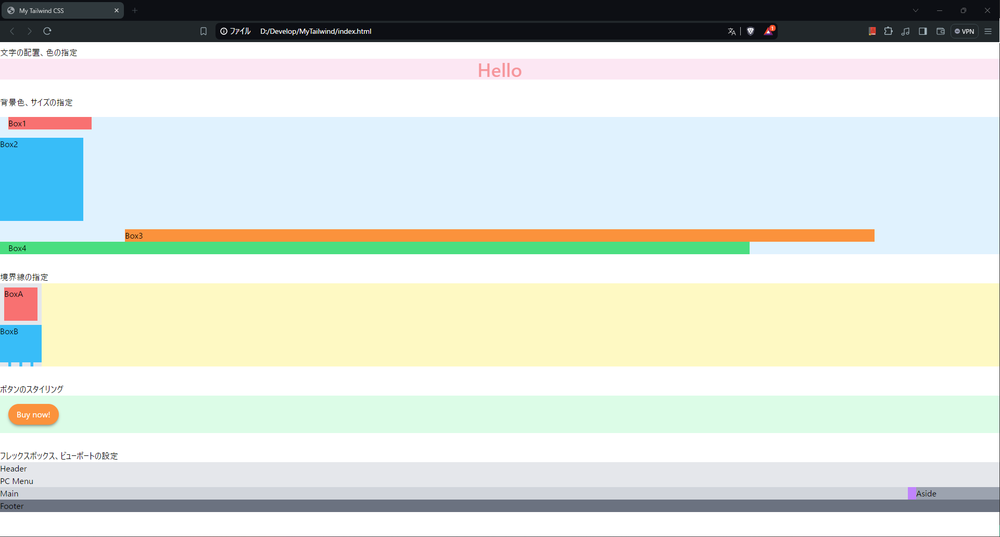

**個人学習用**  
- ソース  
ドットインストール　Tailwind CSS入門(全14回)  
https://dotinstall.com/lessons/basic_tailwindcss  
  
- 実装内容  
  - 文字の配置と色、背景色、サイズの指定
  - 境界線の指定
  - ボタンのスタイリング
  - フレックスボックス、ビューポートの設定
  
- メモ  
Tailwind CSSの導入手順  
    1. HTMLファイルのheadタグに以下を追加
        ```HTML
        <script src="https://cdn.tailwindcss.com"></script>
        ```
    2. tailwind.config.jsファイルを追加する。中身は空でよい。  
  
- 完成形

||  
|:-:|  